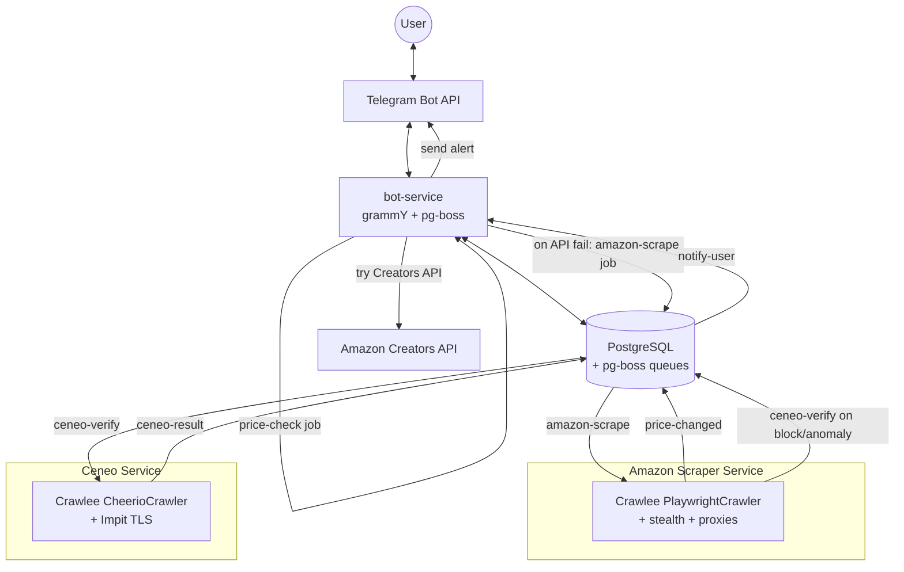
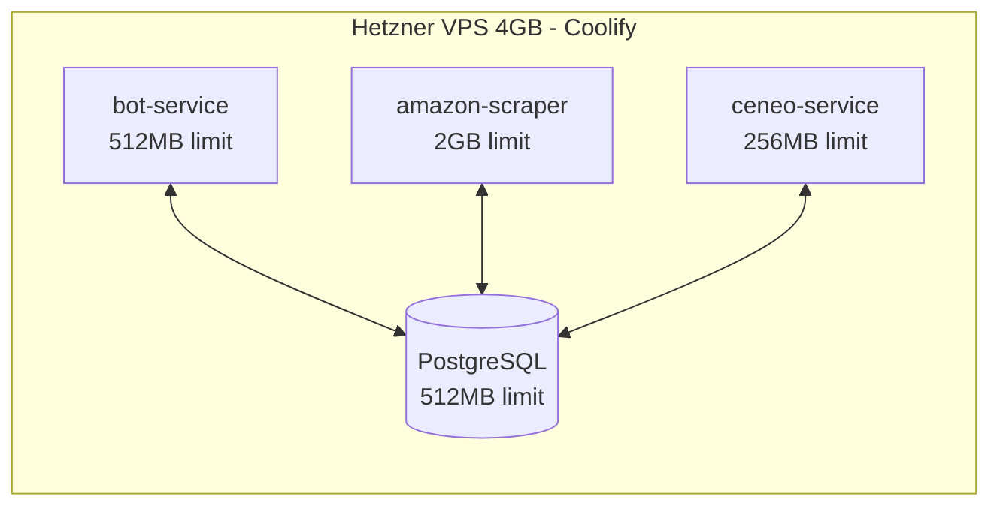
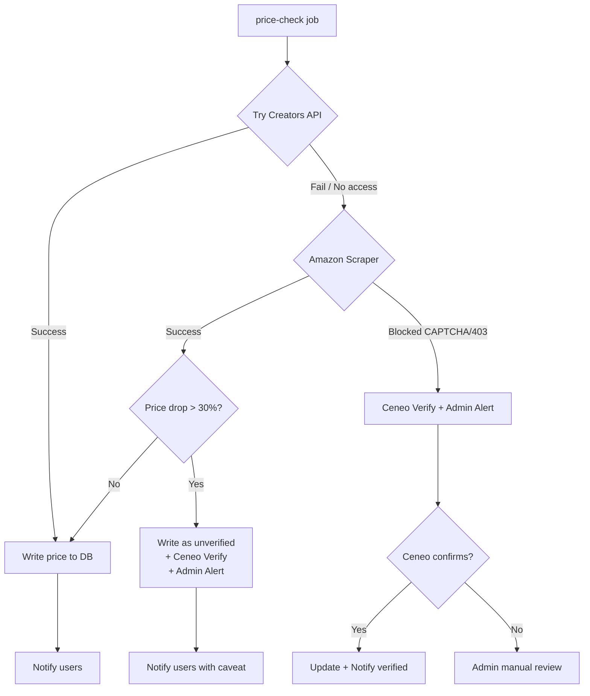
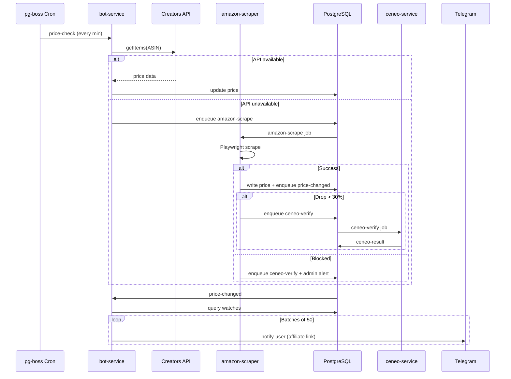

# Architecture: Liskobot (liskobot.pl)

## 1. System Overview

Self-hosted, modular SaaS deployed via **Coolify** on a single Hetzner VPS. Four Docker containers, no external dependencies beyond a proxy provider.



## 2. Container Layout



| Container | Stack | RAM | Role |
|---|---|---|---|
| bot-service | Node/TS, grammY, pg-boss | ~200MB | Telegram bot, Creators API, scheduler, notifications |
| amazon-scraper | Crawlee PlaywrightCrawler + stealth | ~1.5GB | Scrape Amazon.pl product pages |
| ceneo-service | Crawlee CheerioCrawler + Impit | ~100MB | Verify Amazon prices via Ceneo.pl |
| postgres | PostgreSQL 16 | ~256MB | DB + pg-boss job queues |

## 3. Data Source Fallback Chain



Priority order:
1. **Amazon Creators API** - REST call from bot-service (OAuth 2.0, post 10-sale threshold).
2. **Amazon Scraper** - Playwright + stealth + residential proxies. Primary source during cold-start.
3. **Ceneo Verification** - HTTP only. Triggered on Amazon blocks or anomalous drops (>30%).

## 4. Smart Scheduler

pg-boss cron fires every minute. Bot-service queries due products and dispatches jobs.

### Priority Formula
```
priority = log10(subscriber_count + 1) * volatility_factor
```

### Tiered Intervals

| Condition | Interval | Rationale |
|---|---|---|
| `price < 30 PLN` | Max 24h | Low commission |
| `subscriber_count > 100` | Floor 15min | High revenue potential |
| `volatility_score > 0.8` | 30min | Frequently changing |
| Default | 4h | Baseline |

## 5. Job Flow (pg-boss Queues)



### Queue Summary

| Queue | Producer | Consumer |
|---|---|---|
| `price-check` | pg-boss cron | bot-service |
| `amazon-scrape` | bot-service | amazon-scraper |
| `price-changed` | amazon-scraper | bot-service |
| `ceneo-verify` | amazon-scraper / bot-service | ceneo-service |
| `ceneo-result` | ceneo-service | bot-service |
| `notify-user` | bot-service | bot-service |

## 6. Data Schema

```sql
products
  asin              text PRIMARY KEY
  title             text
  current_price     numeric
  historical_low    numeric
  is_in_stock       boolean
  ceneo_id          text              -- cached Ceneo mapping
  volatility_score  numeric
  subscriber_count  integer           -- denormalized
  last_scraped_at   timestamptz
  next_check_at     timestamptz
  created_at        timestamptz

watches
  id                uuid PRIMARY KEY
  telegram_chat_id  bigint
  asin              text REFERENCES products
  target_price      numeric
  notify_historical_low  boolean DEFAULT true
  is_active         boolean DEFAULT true
  created_at        timestamptz

price_history
  id                bigint GENERATED ALWAYS AS IDENTITY
  asin              text REFERENCES products
  price             numeric
  source            text              -- 'creators_api' | 'amazon_scraper' | 'ceneo'
  recorded_at       timestamptz
  -- INDEX (asin, recorded_at)
```

## 7. Technology Stack

| Layer | Technology |
|---|---|
| Language | TypeScript (Node.js 22+) |
| Telegram bot | grammY |
| Amazon scraper | Crawlee PlaywrightCrawler + stealth |
| Ceneo scraper | Crawlee CheerioCrawler + Impit |
| Amazon API | Creators API SDK (OAuth 2.0) |
| Job queue | pg-boss (PostgreSQL-backed) |
| Database | PostgreSQL 16 |
| ORM | Drizzle ORM or Kysely |
| Crawler scaffolding | apify-cli (local project setup) |
| Deployment | Coolify (Docker) |
| Proxies | IPRoyal or Scrapeless (residential) |
| VPS | Hetzner 4GB ARM (~$7/mo) |

## 8. Estimated Monthly Cost

| Item | Cost |
|---|---|
| VPS (Hetzner 4GB) | ~$7 |
| Residential proxies | ~$2.25 |
| Domain (optional) | ~$1 |
| **Total** | **~$10-15/mo** |
