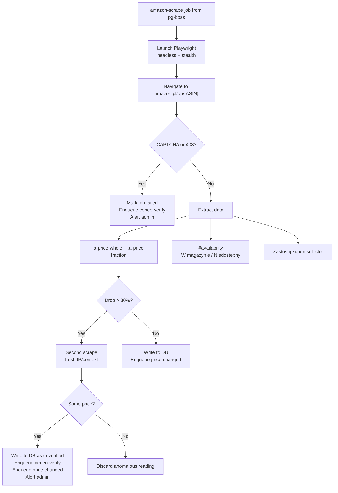
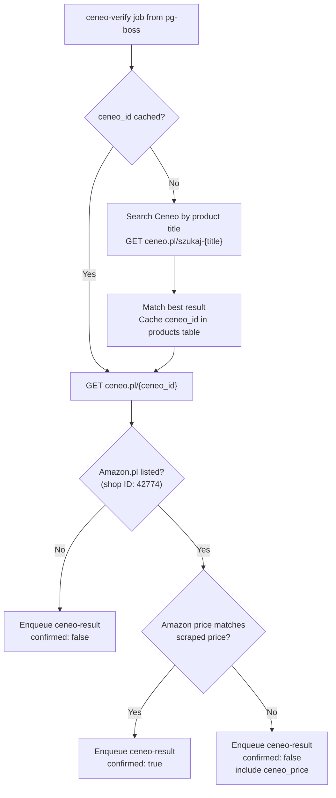

# Scraper Engine: Deep-Dive Design

## 1. Amazon Scraper Service

### Technical Stack
- **Framework:** Crawlee (`PlaywrightCrawler`)
- **Engine:** Playwright (Chromium) + `playwright-extra` + `puppeteer-extra-plugin-stealth`
- **Proxy Provider:** IPRoyal or Scrapeless (Residential Pay-As-You-Go)
- **Proxy/Session Management:** Crawlee built-in `ProxyConfiguration` + `SessionPool`
- **Resource Blocking:** Images, CSS, Fonts, Ads blocked (~150KB per page load)
- **Container:** Dedicated Coolify service, `mem_limit: 2GB`

### Scraping Workflow

### Verified Selectors (tested 2026-02-17)

**Price extraction:**
- **Primary:** `.a-price-whole` + `.a-price-fraction`
  - `.a-price-whole` returns `"1 171,"` — contains non-breaking space (thousand separator) and trailing comma. Must strip both.
  - `.a-price-fraction` returns `"00"` — clean.
  - Parsing: `whole.replace(/[\s,]/g, '')` + `'.'` + `fraction` → `"1171.00"`
- **Alternative:** `#corePrice_feature_div .a-price .a-offscreen` returns `"1 171,00zł"` — single element, but only present when buy box exists (null on out-of-stock/third-party-only).
- **Caution:** `.a-price .a-offscreen` without scoping returns 30+ prices (related products, other sellers). Always scope to `#corePrice_feature_div`.

**Stock detection:**
- Do NOT rely on `#availability` text — it contains JavaScript on some pages and text varies widely ("Gotowe do wysyłki w ciągu 1–2 dni", not always "W magazynie").
- **Recommended approach:**
  - `isInStock = (#add-to-cart-button exists) OR (#buy-now-button exists)`
  - `isThirdPartyOnly = (#buybox-see-all-buying-choices exists) AND NOT isInStock`
  - Third-party-only pages show "Wszystkie opcje zakupu" button and prices from sellers, but no direct buy box.

**Other selectors:**
- **Title:** `#productTitle` — verified, works on all page types.
- **ASIN:** `input[name="ASIN"]` — verified, works on all page types.
- **CAPTCHA:** `form[action="/errors/validateCaptcha"]` — standard Amazon CAPTCHA form.

### Configuration
- **Concurrency:** 1 browser instance, sequential scrapes in fresh incognito contexts
- **Headers:** `Accept-Language: pl-PL,pl;q=0.9,en-US;q=0.8,en;q=0.7`
- **Crawlee SessionPool:** Auto-retires blocked proxies, rotates IPs per session
- **Crawlee retries:** 3 attempts with backoff before marking job as failed

### Failure Handling
- pg-boss handles retry logic: 3 attempts with exponential backoff
- After 3 failures: job moves to dead letter queue + admin Telegram alert
- Hourly success rate tracked. Alert if <85%

## 2. Ceneo Verification Service

### Technical Stack
- **Framework:** Crawlee (`CheerioCrawler`)
- **HTTP Client:** Impit (`@crawlee/impit-client`) for browser-grade TLS fingerprinting
- **No Playwright/Chromium required** - Ceneo renders prices server-side
- **Container:** Dedicated Coolify service, `mem_limit: 256MB`

### Verification Workflow

### Ceneo Data Points
- **Price:** Direct text in HTML (server-rendered)
- **Shop identification:** Shop ID `42774` = Amazon.pl
- **Shipping:** "Darmowa wysylka" or "Wysylka od X zl"
- **Availability:** "Sprawdz w sklepie"

### ASIN-to-Ceneo Mapping
- On first verification for a product, search Ceneo by product title
- Cache the matching `ceneo_id` in `products.ceneo_id`
- Subsequent verifications use cached ID directly

## 3. Cost & Performance

| Metric | Amazon Scraper | Ceneo Service |
|---|---|---|
| Data per check | ~150KB (with blocking) | ~50KB (HTML only) |
| RAM usage | ~1.5GB (Chromium) | ~100MB (no browser) |
| Proxy needed | Residential (required) | VPS IP or datacenter (Ceneo is lax) |
| Cost per 10k checks | ~$2.25 | ~$0.10 |

### When Ceneo is Triggered
1. Amazon scraper blocked (CAPTCHA/403) - fallback data source
2. Anomalous price drop >30% detected - cross-verification
3. Admin is notified via Telegram in both cases for manual review
