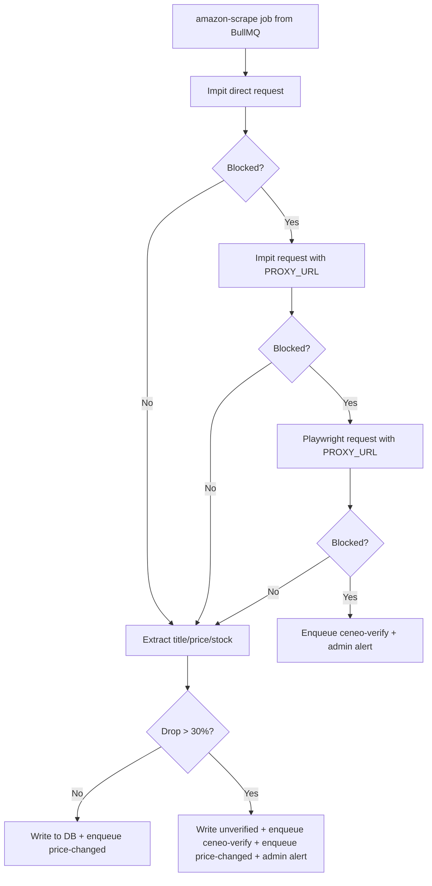
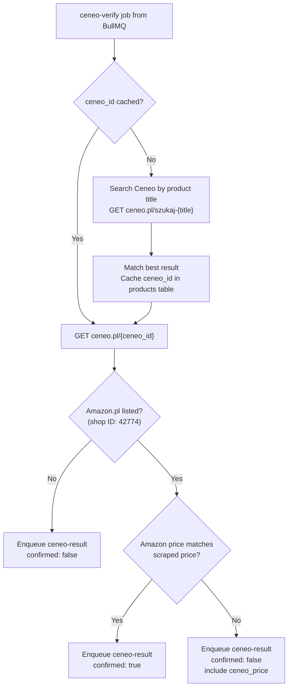

# Scraper Engine: Deep-Dive Design

## 1. Amazon Scraper Service

### Technical Stack
- **Frameworks:** Crawlee (`CheerioCrawler` + `PlaywrightCrawler`)
- **HTTP engine (primary):** Impit (`@crawlee/impit-client`) with browser-like TLS/headers
- **Browser engine (last fallback):** Playwright Chromium
- **Proxy Provider:** IPRoyal or Scrapeless (Residential Pay-As-You-Go)
- **Fallback chain:** `Impit direct -> Impit proxy -> Playwright proxy`
- **Container:** Dedicated Coolify service, `mem_limit: 2GB` (high memory only during Playwright fallback)

### Scraping Workflow

### Block Detection

- **Hard block:** status `403/503` or `form[action="/errors/validateCaptcha"]`.
- **Soft block (`200`):** robot-check / automated-access patterns in title/body (for example: `Robot Check`, `verify you are human`, `to discuss automated access to Amazon data`), with missing core product signals.

### Verified Selectors (tested 2026-02-20)

**Price extraction (scoped, shared across Impit + Playwright):**
- `#corePriceDisplay_desktop_feature_div .a-price .a-offscreen`
- `#corePrice_feature_div .a-price .a-offscreen`
- `#corePrice_desktop .a-price .a-offscreen`
- `#apex_desktop .apex-core-price-identifier .a-price .a-offscreen`
- `#tp_price_block_total_price_ww .a-offscreen`
- Fallback: `input#priceValue`
- Behavior: if none exists, `price = null` (valid for some out-of-stock pages).

**Stock detection:**
- `isInStock = (#add-to-cart-button exists) OR (#buy-now-button exists)`
- No reliance on `#availability` text due inconsistent/JS-driven content.

**Title and CAPTCHA selectors:**
- Title: `#productTitle`
- CAPTCHA form: `form[action="/errors/validateCaptcha"]`

### Configuration
- **Impit concurrency:** 1
- **Playwright concurrency:** 1 (only when Impit attempts are blocked)
- **Headers:** `Accept-Language: pl-PL,pl;q=0.9,en-US;q=0.8,en;q=0.7`
- **Playwright resources blocked:** images, stylesheets, fonts, media
- **Playwright lifecycle:** created only for fallback attempt and torn down immediately after the request

### Failure Handling
- If all three strategies block, enqueue `ceneo-verify` (`reason: amazon_blocked`) and alert admin path in bot service.
- BullMQ handles retry logic / backoff for failed jobs.
- Blocking and fallback strategy are logged for observability (`impit_direct`, `impit_proxy`, `playwright_proxy`).

## 2. Ceneo Verification Service

### Technical Stack
- **Framework:** Crawlee (`CheerioCrawler`)
- **HTTP Client:** Impit (`@crawlee/impit-client`) for browser-grade TLS fingerprinting
- **No Playwright/Chromium required** - Ceneo renders prices server-side
- **Container:** Dedicated Coolify service, `mem_limit: 256MB`

### Verification Workflow

### Ceneo Data Points
- **Price:** Direct text in HTML (server-rendered)
- **Shop identification:** Shop ID `42774` = Amazon.pl
- **Shipping:** "Darmowa wysylka" or "Wysylka od X zl"
- **Availability:** "Sprawdz w sklepie"

### ASIN-to-Ceneo Mapping
- On first verification for a product, search Ceneo by product title
- Cache the matching `ceneo_id` in `products.ceneo_id`
- Subsequent verifications use cached ID directly

## 3. Cost & Performance

| Metric | Amazon Scraper | Ceneo Service |
|---|---|---|
| Data per check | ~50-200KB (Impit, selector-dependent) | ~50KB (HTML only) |
| RAM usage | ~200MB baseline, up to ~1.5GB during Playwright fallback | ~100MB (no browser) |
| Proxy needed | Optional for direct Impit, recommended for fallback reliability | VPS IP or datacenter (Ceneo is lax) |
| Cost per 10k checks | ~$2.25 | ~$0.10 |

### When Ceneo is Triggered
1. Amazon scraper blocked after all strategies (`Impit direct -> Impit proxy -> Playwright proxy`) on hard or soft block signals
2. Anomalous price drop >30% detected - cross-verification
3. Admin is notified via Telegram in both cases for manual review
